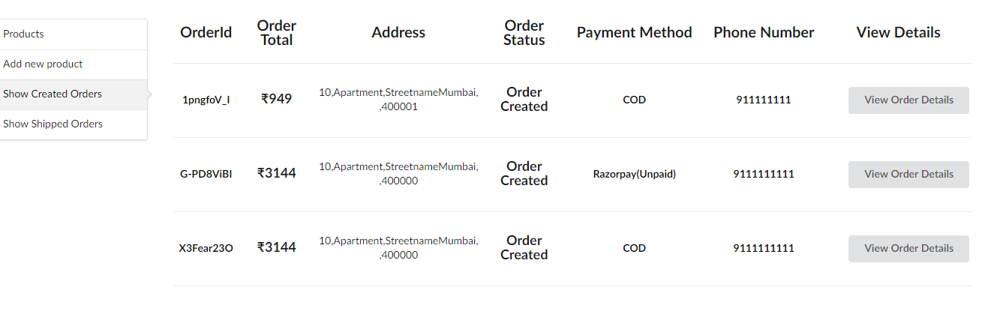

# Ecommerce-MERN

Ecommerce created using React as FrontEnd and Node.js,Express for Backend and MongoDB(Mongoose) for Database.

### Features of Ecommerce (Client)

- Payment Gateway(Razorpay or COD)
- Search by keyword,category
- Cart stored using React Context

### Features of Ecommerce (Admin)

- Order Management
- Product Management
- Add shipment Details

## Things to setup setup

1. Download all npm packages in both directory using
   `npm install`

2. Create account on Mongodb and create a new collection and get the url for DB_connection & Similarly for Razorpay create Test account to get RazorpaySecret and Razorpay_ID and paste razorpay key in `PaymentOptions.js at line 84`

3. Setup up all the credentials in .env file
   ```
   DB_CONNECTION="mongodb+srv:MONGODB ATLAS"
   Razorpay_key_id=RAZORPAYID
   Razorpay_key_secret=RAZORPAYSECRET
   JWT_SECRET=JWTSECRET
   ```
4. For razorpay webhooks enter url :http://yourbackendserver.xxxx/verifypayment

### Understanding the flow of code-FrontEnd

So the website is divided into three main component Header,Footer and Section
The header and footer and constant.The Section component is changing with help of react-router-dom.

1. <u><b>Displaying Products</b></u>:The products are displayed in three pages
   `Home.js` `Disposable.js` `Salon.js`

   Home page displays all products ,carousel and search bar.
   While Disposable,salon show their respective product and also have search bar.

2. <u><b>Cart `cart.js`</b></u>:Inside Cart page all the products in cart are displayed and all the products can be increased or decreased or removed.(Note:The product count cant exceed the stock
   
3. <u><b>Checkout & payment</b></u>:Checkout page has main page `Checkout.js`.With the help of swtich and cases the checkout process is broken down into 4 pages
   `CustomerDetails.js`-> `CustomerConfirmed.js`-> `PaymentOptions.js`->`OrderPlaced.js`
   
   
4. <u><b>AdminPanel `Adminpanel.js`</b></u>:Adminpanel has login page once logged in the Jwt session token is stored in localstorage. It has four pages
   `Addproduct.js` `Showcreatedorders.js` `Showshippedorders.js` & show Product page is already inside the adminpanel.js
   
   To update the product details a model is rendered using `ProductDetails.js`
   The orders rendered inside `Showcreatedorders.js`  `Showshippedorders.js`  are done by passing props orders array inside `Displayorder.js` and to update/view order `OrderDetails.js` is rendered
     


5) <u><b>Context`Context.js`</b></u> is the place where API call to get products and function to increase and decrease quantity and remove products inside cart.This uses React Context which helps in easy passing data without props in component

### Understanding the flow of code-BackEnd

There are three folders models,routes and middleware
Models contain the schema for MongoDB.There are three models `Customer.js` `Order.js` `Product.js`.
Routes contains all the routes which are available

1. `Addproduct.js` :Adds a new product into database and image is stored using Multer and stored in backend server /uploads folder
2. `adminpanel.js`: Basically adminpanel is use to authenicate the user (Login form)
3. `createOrder.js`: Creates order and customer entry in database there are two types and payment details like COD and Razorpay.For Razorpay the status will be unpaid until it is verified.For COD the stock of respective product will decrease
4. `deleteproduct.js`:Finds the product in database and deletes the particular database entries
5. `getproducts.js`:Returns all the products and all the category and subcategory names.
6. `verifypayment.js`:It is used to verify payment made using Razorpay through webhooks and stock is decreased (As order is confirmed)
7. `showorders.js`:Returns all the orders
8. `updateorder.js`:Upate the order status to shipped and adds CourierName and TrackingID
9. `upateproduct.js`:Update the product price,stock,title,description except image

Middleware has `checkAuth.js` which can be added to protect the route restricted to admin
`Index.js` is the place where the all the routes are defined and where mongoDB is connected
